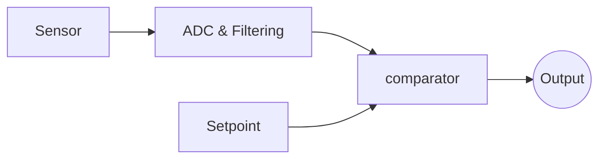
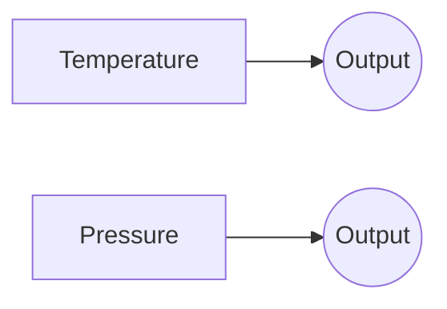
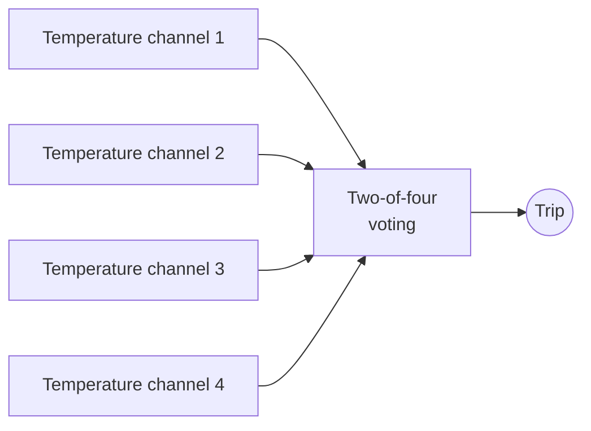

---

# Instrumentation channel

```mermaid
graph LR
    A[Sensor] --> B[ADC & Filtering]
    B --> C[comparator]
    D[Setpoint] --> C 
    C --> E((Output))
```

---

# Division

```mermaid
graph LR
    A[Temperature] --> B((Output))
    C[Pressure] --> D((Output))
```

---

# Trains of actuation logic

```mermaid
graph LR
    A[Temperature channel 1] --> E[Two-of-four<br>voting]
    B[Temperature channel 2] --> E[Two-of-four<br>voting]
    C[Temperature channel 3] --> E[Two-of-four<br>voting]
    D[Temperature channel 4] --> E[Two-of-four<br>voting]
    E --> F((Trip ))
```

